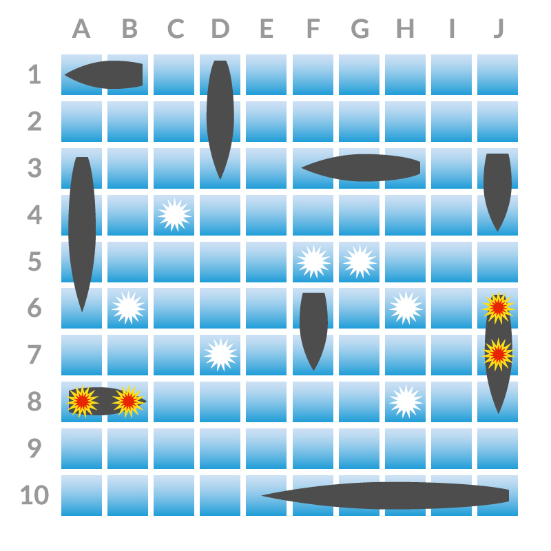
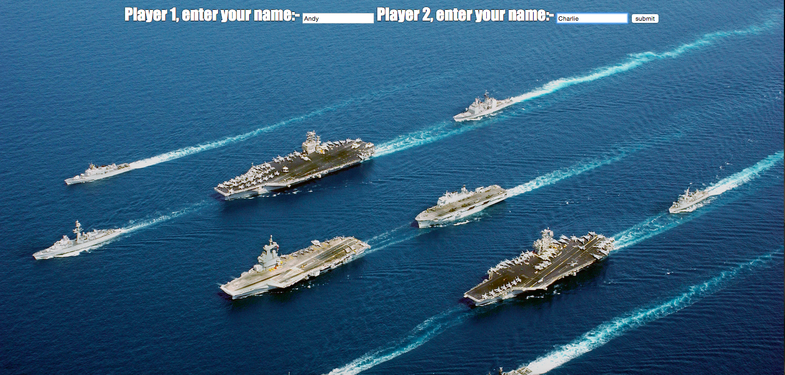
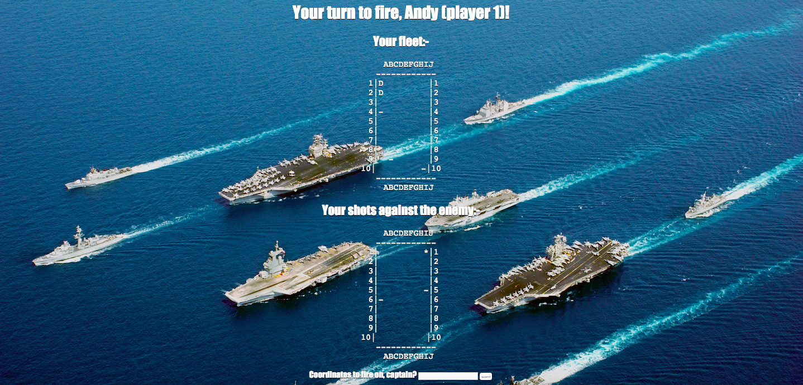
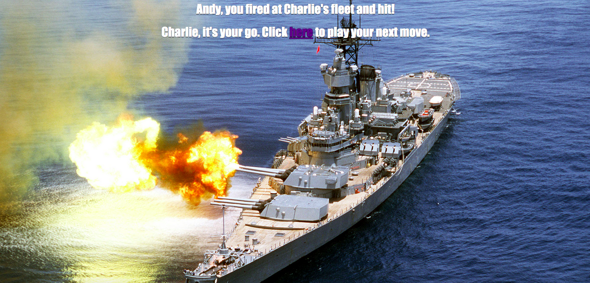
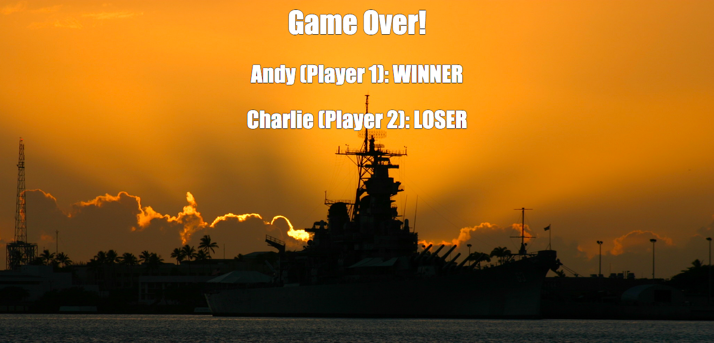

Battleships UI
=================


Brief:
-------

Create a graphical interface for users to play a game of Battleships.

Battleships is a tactical game where each player has a 10x10 two dimensional grid board upon which they can place a number of ships of varying sizes. The players take it in turns to call a grid reference with the aim of striking a hit on one of their opponent's ships. The winner is the first to sink their opponent's entire fleet.




Technologies used:
-------

- [Sinatra](http://www.sinatrarb.com/) (software web application framework and domain-specific language written in Ruby)
- [RSpec](http://rspec.info/) (Behaviour Driven Development for Ruby)
- [Capybara](https://github.com/jnicklas/capybara) (test web applications by simulating how a real user would interact with your app)
- [Cucumber](https://cucumber.io/) (software tool that computer programmers use for testing other software; runs automated acceptance tests written in a behaviour-driven development (BDD) style; written in the Ruby programming language)


Sinatra tutorial:
-------

#### Installation

- Add below to `Gemfile` and then run `$ bundle`:

````ruby
source 'https://rubygems.org'
gem 'sinatra'
````

#### Adding a controller

Create new file `controller.rb` and add:

````ruby
require 'sinatra'

get '/' do
  'hello!'
end
````

Enter `$ ruby controller.rb` and visit `http://localhost:4567` to see text displayed on screen

Add another page to `controller.rb`:

````ruby
get '/secret' do
  'This is a secret page'
end
````

Visit `http://localhost:4567/secret` (having first shut down server (`Crtl-C`) and restarted: `$ ruby controller.rb`) to see new page

#### Shotgun

To prevent server restart for each page change, install gem called Shotgun (in `Gemfile` add: `gem 'shotgun'` and run `bundle`):

Load app using Shotgun (specifying port with `-p` switch to keep consistent with Sinatra (4567) as Shotgun's default port is 9393):

`$ shotgun controller.rb -p 4567`

#### Creating views

In root, create `views/index.erb`, adding:

````ruby
<div style='border: 3px dashed red'>
  My name is <%= @name %>
  
</div>
````

Change `controller.rb` to point towards this new file:

````ruby
get '/' do
  @name = %w(Amigo Oscar Viking).sample
  erb :index
end
````

#### Parameters (via URL)

````ruby
get '/hello' do
  @visitor = params[:name]
  erb :index
end
````

````ruby
<div style='border: 3px dashed red'>
  <% if @visitor %>
    Hello, <%= @visitor %>!
  <% end %>
  <% if @name %>
    My name is <%= @name %>
  <% end %>
  
</div>
````

Visit `http://localhost:4567/hello?name=Andy` to see the welcome message

#### Parameters (via form submission)

````ruby
<div style='border: 3px dashed red'>
  <% if @visitor %>
    Hello, <%= @visitor %>!
  <% else %>
    <form action="/hello">
      My name is <%= @name %>.
      What's your name?
      <input type="text" name="name">
      <input type="submit" value="Submit">
    </form>
  <% end %>
  
</div>
````

#### Routing (to image file)

Place image file in `public/images/kitten.png` (Sinatra treats everything located inside public folder as available via URLs) and then call the local file as below rather than calling on a URL

````ruby

````


Run server for Battleships UI:
-------

- In root directory: `$ ruby ./lib/battleships_web.rb`


Testing setup:
-------

#### [Capybara](https://github.com/jnicklas/capybara)

- In `Gemfile` add below then run `bundle`:

`gem 'capybara'`


#### [Capybara with RSpec](https://github.com/jnicklas/capybara#using-capybara-with-rspec)

Add to `spec_helper.rb`: `require 'capybara/rspec'`

```
feature 'Home Page' do
  scenario 'view the welcome message' do
    visit '/'
    expect(page).to have_content('Welcome!')
  end
end
```

Run tests: `$ rspec`


#### [Capybara with Cucumber](https://github.com/jnicklas/capybara#using-capybara-with-cucumber)

- Add to `env.rb`:

```
require 'capybara/cucumber'
Capybara.app = MyRackApp
```

Capybara DSL can then be utilised in `web_steps.rb`

```
When /I sign in/ do
  within("#session") do
    fill_in 'Email', :with => 'user@example.com'
    fill_in 'Password', :with => 'password'
  end
  click_button 'Sign in'
end
```

Run tests: `$ cucumber`


User stories:
-------

```
As a player
So that I can prepare for the game
I would like to place a ship in a board location

As a player
So that I can play a more interesting game
I would like to have a range of ship sizes to choose from

As a player
So that I can create a layout of ships to fox my opponent
I would like to be able to choose the directions my ships face in

As a player
So that I can have a coherent game
I would like ships to be constrained to be on the board

As a player
So that I can have a coherent game
I would like ships to be constrained not to overlap

As a player
So that I can win the game
I would like to be able to fire at my opponents board

As a player
So that I can refine my strategy
I would like to know when I have sunk an opponent's ship

As a player
So that I know when to finish playing
I would like to know when I have won or lost

As a player
So that I can consider my next shot
I would like an overview of my hits and misses so far

As a player
So that I can play against a human opponent
I would like to play a two-player game
```


Next steps:
-------

- Server for game be run using `$ shotgun -p 4567` (although `$ shotgun` alone will work but will use port 9393), however *sessions do not work when using shotgun* - to be resolved
- Allow for a one-player game (vs. computer) and a two player game to be played on separate browsers
- Placing ships on the board, inc. error handling for illegal positions (off the board/overlapping with other ships)) / placing the selection of five ships (choosing which ship to place with selection decreasing after each ship is positioned)
- Notification of when individual ships have been sunk, i.e. *You sunk my battleship!*
- Further testing


Links:
-------

[Makers Academy: Playing Battleships in the browser](https://github.com/makersacademy/course/blob/master/battle_ships_web/battle_ships_web_rspec.md)

[Sinatra: Official site - Getting Started](http://www.sinatrarb.com/intro.html)

[Capybara cheat sheet](https://gist.github.com/zhengjia/428105)


Images:
-------

#### Register players


#### Player 1 turn


#### Player 1 fire


#### Game over
